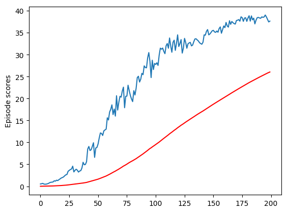

### Learning algorithm

The agent implements a Deep Deterministic Policy Gradient, as described in
https://arxiv.org/abs/1509.02971.  The hyperparameters and implementation
closely follow the paper.  This includes an actor and actor target network with
400 and 300 node hidden layers, along with a similar critic network (which also
takes the action in the first hidden layer).  The only modifications was a batch
normalization of the rewards when training on a minibatch of experiences.  
Without this, the agent failed to learn.  With it, learning progresses quickly.

### Training

The following plots both the per episode score and the 100 episode moving
average:

The average score over the final 100 episodes was 34.91487921959162

### Hyperparameters

# Size of the replay buffer storing past experiences for training
REPLAY_BUFFER_SIZE = 10**6

# Number of experiences to use per training minibatch
BATCH_SIZE = 128

# Number of steps taken between each round of training.  Each agent
# action is considered a step (so 20 simultaneous agents acting mean 20 steps)
STEPS_BETWEEN_TRAINING = 10 * 20 # 20 agents for 20 steps

# Perform training this many times per rouund
ITERATIONS_PER_TRAINING = 10

# Reward decay
GAMMA = 0.99

# Learning rate for the actor network
ACTOR_LEARNING_RATE = 1e-4

# Learning rate for the critic network
CRITIC_LEARNING_RATE = 1e-3

# Rate at which target networks are updated
TAU = 0.001

# Weight decay term used for training the critic network
CRITIC_WEIGHT_DECAY = 0.0001

# Random process parameters
RANDOM_THETA = 0.15
RANDOM_SIGMA = 0.2

### Ideas for future work

It would be interesting to compare the DDPG performance to a PPO implementation.
it would also be interesting to improve DDPG with prioritized experience recall,
which attempts to choose more information dense experiences from the replay
buffer.
